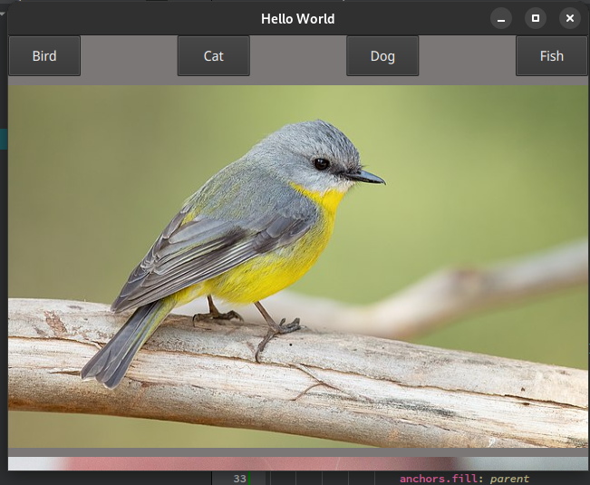
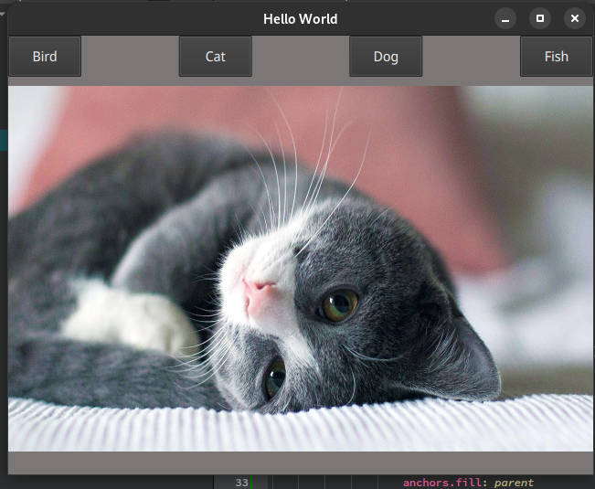
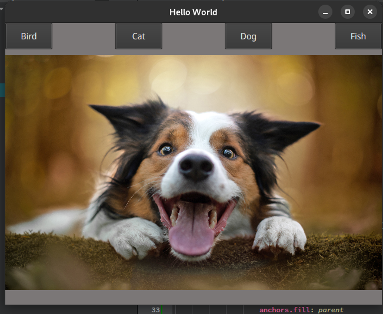
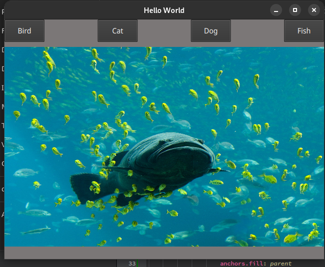

# QT-buttons

## Introduction
This application is all about using QML in order to make a pretty simple application (containing although a lot of complexity) to display image inside of the program's screen.

## Screens

No C++ has been performed inside this application, it is only using QML that is the Qt modeling Language. The only C++ used inside of this, is the main of a Qt application that is state for the display of the QML window content like this one:

I didn't create QML customs elements (using Item outside of the main.qml file) inside this project because the idea was to display only those items (animals image) and it isn't that huge once all the image are inserted into the window image.
I should have used the QML designer to make this project, however I was (and I am) certain that this kind of things can be done using the QML file instead of the designer. The designer can be good for tougher application however, this application has been done in order to create the row and column by-hand without any help other than stack-overflow (the self-taught developer bible ^^) 